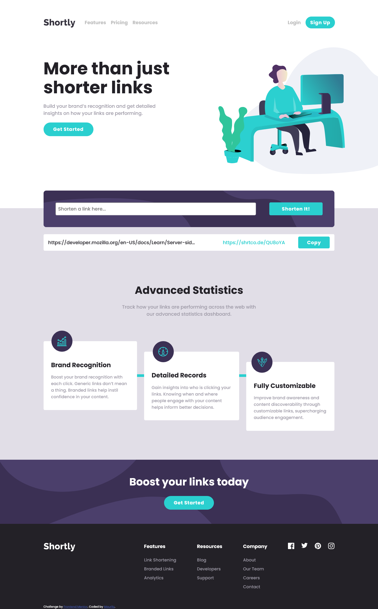

# Frontend Mentor - Shortly URL shortening API Challenge solution

This is a solution to the [Shortly URL shortening API Challenge challenge on Frontend Mentor](https://www.frontendmentor.io/challenges/url-shortening-api-landing-page-2ce3ob-G). Frontend Mentor challenges help you improve your coding skills by building realistic projects. 

## Table of contents

- [Overview](#overview)
  - [The challenge](#the-challenge)
  - [Screenshot](#screenshot)
  - [Links](#links)
- [My process](#my-process)
  - [Built with](#built-with)
  - [What I learned](#what-i-learned)
  - [Continued development](#continued-development)
  - [Useful resources](#useful-resources)
- [Author](#author)

## Overview

### The challenge

Users should be able to:

- View the optimal layout for the site depending on their device's screen size
- Shorten any valid URL
- See a list of their shortened links, even after refreshing the browser
- Copy the shortened link to their clipboard in a single click
- Receive an error message when the `form` is submitted if:
  - The `input` field is empty

### Screenshot




### Links

- Solution URL: [solution URL](https://your-solution-url.com)
- Live Site URL: [live site URL](https://mauritzlm.github.io/url-shortening-api/)

## My process

### Built with

- Semantic HTML5 markup
- CSS custom properties
- Flexbox
- Mobile-first workflow

### What I learned

1. How to handle text overflow with ellipsis. One has to set overflow: hidden and white-space: nowrap in order to make text overflow its container.

```css
.links-list p {
    text-overflow: ellipsis;
    overflow: hidden;
    white-space: nowrap;
}
```

2. How to center an absolute positioned element. Horizontally and vertically.

```css
.statistics-info .line {
    position: absolute;
    height: 100%;
    width: 10px;
    background-color: hsl(180, 66%, 49%);
    left: 0;
    right: 0;
    margin: 0 auto;
    padding: 0;
}

.statistics-info .line {
        height: 10px;
        width: 100%;
        top: 0;
        bottom: 0;
        margin: auto 0;
    }

```

3. I learned about the clipboard API. Accessed using navigator.clipboard. Use navigator.clipboard.writeText(textToCopy) to copy to clipboard. 

```js
 navigator.clipboard.writeText(linkToCopy);
```

### Continued development

I want to keep focusing on building responsive layouts. I also want get more comfortable with structuring a project.

### Useful resources

- [centering an absolute positioned element](https://www.freecodecamp.org/news/how-to-center-an-absolute-positioned-element/) - Easy to understand article on how to center an absolute positioned element.
- [clipboard API reference](https://developer.mozilla.org/en-US/docs/Web/API/Clipboard_API) - MDN reference to the clipboard API.

## Author

- Frontend Mentor - [@MauritzLM](https://www.frontendmentor.io/profile/MauritzLM)


